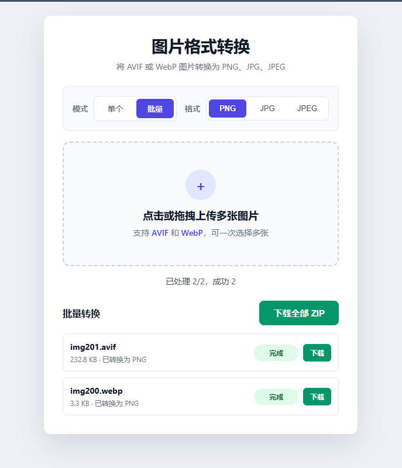

# AVIF/WebP 转 PNG

预览图   

使用方法：   
克隆项目或下载压缩包到本地后解压；   
双击index.html文件，在浏览器打开网页；   
点击或拖拽上传 AVIF 或 WebP 格式图片；   
选择目标格式（PNG、JPG、JPEG）；   
系统自动转换并显示下载按钮；   
所有转换操作均在浏览器本地完成；   

## ⚠️ 仓库说明
本项目**主仓库位于 Gitee**，GitHub 为自动单向同步的只读镜像。

1. 你可以自由 Fork GitHub 上的代码副本，但所有代码提交、Bug反馈、功能建议、Pull Request，请前往 Gitee 主仓库。
2. GitHub仓库所有文件由Gitee自动同步覆盖，任何在此处的手动修改都会丢失。

👉 Gitee主仓库地址：https://gitee.com/miaoaa66/avif-or-webp-to-png
