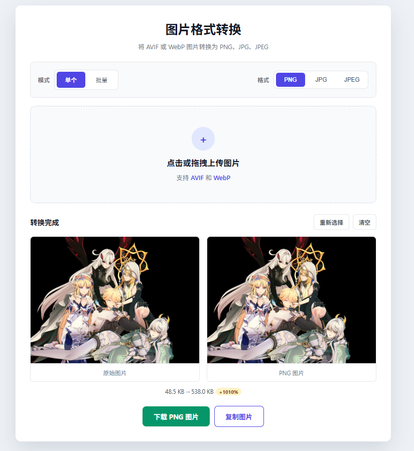
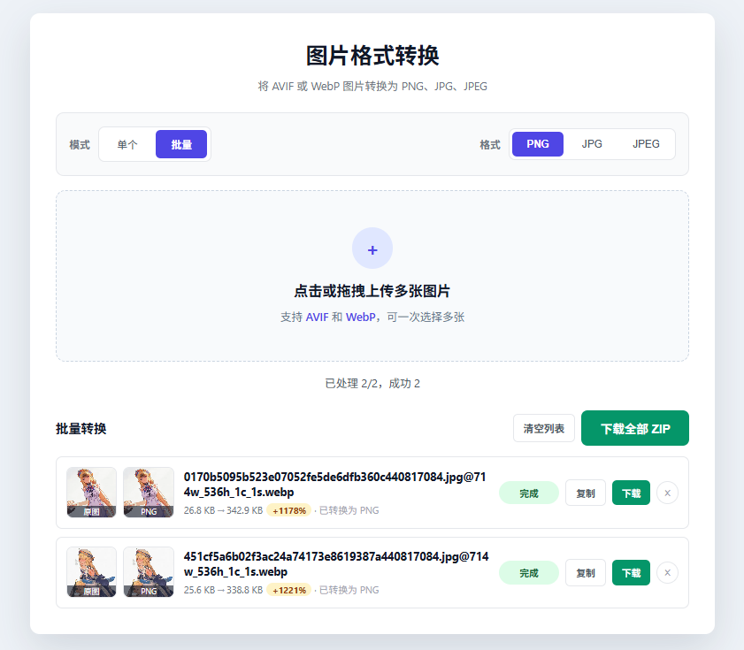
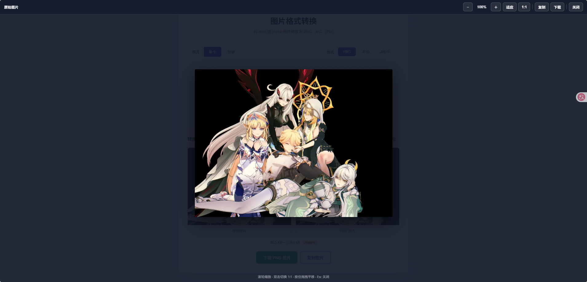

# 图片格式转换（AVIF / WebP → PNG / JPG / JPEG）

一个**纯前端、零上传**的图片格式转换工具。基于浏览器 Canvas 完成解码与重编码，所有处理都在你的设备本地进行，图片不会离开浏览器、不会被上传到任何服务器。

> **MIT 协议** · **单文件 · 无构建** · **离线可用** · **无需安装**

---

## 📖 简介

把 **AVIF** 或 **WebP** 图片转换成更通用的 **PNG / JPG / JPEG** 格式。无需安装软件、无需联网、无需注册，双击 `index.html` 即可在浏览器中使用。

适合的场景：下载到的 AVIF / WebP 图片在旧软件里打不开、需要转成 PNG 做进一步编辑、需要把 WebP 转 JPG 用于文档等。

---

## 🖼️ 预览

### 单张模式

上传后并排显示「原始图片 / 转换后图片」，并给出**体积对比**与压缩率。



### 批量模式

一次选择多张，列表逐项显示缩略图、体积变化与状态，支持**下载全部（打包为 ZIP）**。



### 放大预览

点击任意图片进入全屏查看器，支持缩放、适应窗口、1:1 实际像素、拖拽平移，以及复制与下载。



---

## ✨ 功能特性

### 转换

- **输入格式**：AVIF、WebP
- **输出格式**：PNG、JPG、JPEG
- **质量可调**：转 JPG / JPEG 时可用滑块调节质量（50% – 100%，默认 92%）；PNG 为无损格式，不显示该选项
- **体积对比**：显示转换前后的文件大小与压缩率，变小为绿色、变大为琥珀色
- **透明通道处理**：转 PNG 保留透明；转 JPG / JPEG 时自动铺白底，避免透明区域变成黑块

### 单张模式

- 点击或拖拽上传
- 原图 / 转换后并排预览，并显示转换前后的体积对比与压缩率
- 重新选择 / 清空
- 下载、复制到剪贴板

### 批量模式

- 一次选择或拖拽多张图片
- 每项显示「原图 / 转换后」缩略图，转换中、等待、失败均有状态占位
- 单项移除、一键清空列表
- 逐张下载，或**打包为 ZIP 一次性下载全部**
- 切换输出格式 / 调整质量时自动复用已解码的原图重新编码，不重复解码

### 通用交互

- **拖拽上传**：把图片拖到页面任意位置即可，带全屏「松手即可上传」提示
- **点击放大**：任意预览图、缩略图点击后进入全屏查看器
- **复制到剪贴板**：一键复制转换结果（需在安全上下文下使用，详见「常见问题」章节）
- **大图保护**：超出浏览器画布上限的图片会自动降采样并给出明确提示，不会静默失败或卡死
- **响应式**：桌面与移动端布局自适应

---

## 🚀 使用方法

### 方式一：直接打开（最简单）

1. 克隆本项目，或下载压缩包后解压：

   ```bash
   git clone https://gitee.com/miaoaa66/avif-or-webp-to-png.git
   ```

2. 双击 `index.html`，用浏览器打开；
3. 点击或拖拽上传 AVIF / WebP 图片；
4. 选择目标格式（PNG / JPG / JPEG）；
5. 转换完成后下载结果。

> 所有转换操作均在浏览器本地完成，无需网络。

### 方式二：本地服务器（推荐，可用剪贴板功能）

浏览器的剪贴板 API（复制图片）要求「安全上下文」。以 `file://` 方式直接打开时该 API 会被浏览器禁用，此时「复制图片」会提示改用下载。若需要复制功能，启动一个本地静态服务器后访问即可：

```bash
# Python 3
python -m http.server 8000

# 或 Node.js
npx serve .
```

然后浏览器访问 `http://localhost:8000/`。

---

## 🌐 浏览器兼容性

本工具依赖浏览器原生的 AVIF / WebP 解码能力与 Canvas 编码能力：

| 浏览器 | 最低版本 | 说明 |
| --- | --- | --- |
| Chrome | 85+ | 完整支持 |
| Edge | 85+ | 完整支持 |
| Firefox | 93+ | 完整支持 |
| Safari | 16+ | 完整支持（16 起支持 AVIF） |

> 若浏览器本身不支持解码 AVIF，会提示「图片加载失败」，此时请更换较新版本的浏览器。

---

## 📁 项目结构

```
avif-or-webp-to-png/
├── index.html          # 全部页面结构、样式与逻辑（单文件）
├── static/
│   ├── vue.3.5.38.js   # Vue 3（本地引入，不走 CDN）
│   └── jszip.min.js    # 批量打包 ZIP 用
├── preview/            # README 预览图
├── 素材/               # 示例图片（用于开发调试）
├── LICENSE             # MIT 协议
└── README.md
```

- **单文件**：所有逻辑与样式都收敛在 `index.html` 内。
- **无构建**：没有 npm、没有打包步骤，双击即用。
- **离线可用**：第三方库放在本地 `static/`，不依赖任何外部 CDN。

---

## 🔒 隐私与安全

- 图片**只在本机浏览器内存中处理**，不经过任何服务器，不产生网络请求（除加载本地 `static/` 资源外）。
- 关闭或刷新页面后，所有已加载的图片与转换结果都会被释放。
- 可以断网使用，功能完全不受影响。

---

## ❓ 常见问题

### 为什么「复制图片」按钮提示不支持？

浏览器的 Clipboard API 只在**安全上下文**（HTTPS 或 `http://localhost`）下可用。以 `file://` 双击方式打开时会被浏览器禁用。

解决方式：用本地服务器打开（见上方「方式二：本地服务器」），复制功能即可正常使用。

### 转换后的文件变大 / 变小了，正常吗？

正常。界面会显示实际压缩率：

- WebP 本身压缩效率较高，转为 PNG 通常**变大**；
- 转 JPG / JPEG 时可通过质量滑块控制体积，降低质量可显著减小体积。

### 转出来的 JPG 图片透明区域变成白色了？

这是**预期行为**。JPG / JPEG 格式本身不支持透明通道，因此透明区域会自动填充为白色（而不是黑色）。如果需要保留透明，请选择输出 **PNG**。

### 上传某些 AVIF 文件提示「格式不支持」？

部分系统（如 Windows）对 `.avif` 文件的 MIME 类型识别为空。本工具已按**文件扩展名**兜底判断，正常情况不会误判。若仍失败，请确认文件扩展名为 `.avif` / `.webp`，且浏览器版本达标。

### 图片太大无法转换？

浏览器 Canvas 存在最大尺寸限制（边长约 16384px）。对于超过上限的图片，本工具会自动**降采样**到可处理尺寸并给出提示，转换仍可正常完成。

---

## ⚠️ 仓库说明

本项目**主仓库位于 Gitee**，GitHub 为自动单向同步的只读镜像。

1. 你可以自由 Fork GitHub 上的代码副本，但所有代码提交、Bug 反馈、功能建议、Pull Request，请前往 Gitee 主仓库。
2. GitHub 仓库所有文件由 Gitee 自动同步覆盖，任何在此处的手动修改都会丢失。

👉 Gitee 主仓库地址：https://gitee.com/miaoaa66/avif-or-webp-to-png

---

## 📄 开源协议

本项目基于 [MIT License](./LICENSE) 开源，Copyright (c) 2026 Miaoaa。
